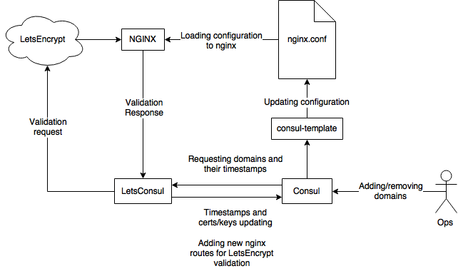

# Letsconsul

**STATUS:** *prototyping/experimental*

Tool that helps you automatically renew LetsEncrypt certificates and serve them in consul K/V storage.

*Note: It is tightly integrated with proxy-server (nginx in this case) and `consul-template` tool. Please read below for full understanding of certificate issuing and installation process.*

## Get started

At first create following K/V structure in Consul:

```
letsconsul
|_
| \_renew_interval = 168h
|_
| \_reload_interval = 10s
|_
| \_service = letsconsul
|_
| \_domains_enabled = ["example.com", "qlean.ru"]
|_
   \_domains
     |_
     | \_example.com
     |   |_
     |   | \_domain_list = ["www.example.com", "example.com"]
     |   |_
     |   | \_email = admin@example.com
     |   |_
     |   | \_timestamp = 0
     |   |_
     |   | \_private_key =
     |   |_
     |     \_fullchain =
     |_
       \_qlean.ru
         |_
         | \_domain_list = ["qlean.ru", "www.qlean.ru", "assets.qlean.ru"]
         |_
         | \email = webmaster@qlean.ru
         |_
         | \_timestamp = 0
         |_
         | \_private_key =
         |_
           \_fullchain =
```

Consul configuration keys:

- `renew_interval` - domain certificate expiration time
- `reload_interval` - time after letsconsul reloading domains information from consul
- `service` - consul service name
- `domains_enabled` - domains from `letsconsul/domains` that can be validated and renewed with certs/keys

When letsconsul starting it reading particular command line arguments:

- `-b` - host:port variable that validation web-server will listen (by default 0.0.0.0:8080)
- `-c` - consul address (by default 127.0.0.1:8500)

Also, you can specifly consul ACL token with CONSUL_TOKEN environment variable.

Example of usage:

```
$ wget https://github.com/hypersleep/letsconsul/releases/download/0.0.2/letsconsul-linux-64.zip
$ unzip letsconsul-linux-64.zip
$ ./letsconsul -b 0.0.0.0:8080 -c 127.0.0.1:8500
```

## Workflow description

After app starts, it fetching domains information from consul by given `consul_service` key, checking certificate expiration time and if more than `renew_interval` then starts certificate renew process.

Updating and receiving certificates is based on LetsEncrypt HTTP validation.

After validation request has sent to LetsEncrypt, letsconsul starts a validation web-server on address `-b` that should receive a LetsEncrypt validation request.

Ensure that validation web-server available from internet! You can simply do this with combination of nginx proxy and consul-template:

```
server {
    listen 80;
    server_name www.example.com example.com;

    {{range service "letsconsul"}}
    location /.well-known/acme-challenge {
        proxy_set_header Host $host;
        proxy_pass http://{{.Address}}:{{.Port}};
    }
    {{end}}
}
```

If validation will be made successfully, letsconsul writes received certificates and keys to `fullchain` and `private_key` consul keys.

After that you can use values of `fullchain` and `private_key` as cert/key files for nginx using consul-template:

/etc/ssl/example.com.crt.ctmpl:
```
{{key "letsconsul/domains/example.com/fullchain"}}
```
rendering to: /etc/ssl/example.com.crt

/etc/ssl/example.com.key.ctmpl:
```
{{key "letsconsul/domains/example.com/private_key"}}
```
rendering to: /etc/ssl/example.com.key

Finally, you're got fully automated and distributed by many servers/proxies HTTPS certificates!

You can see full workflow on following chart:


